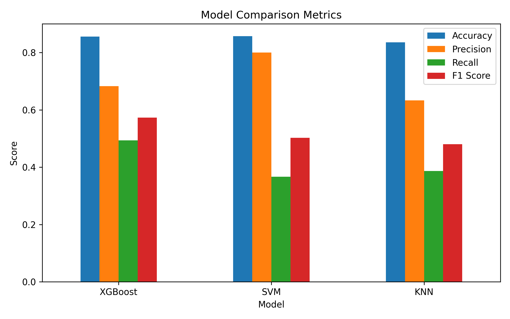
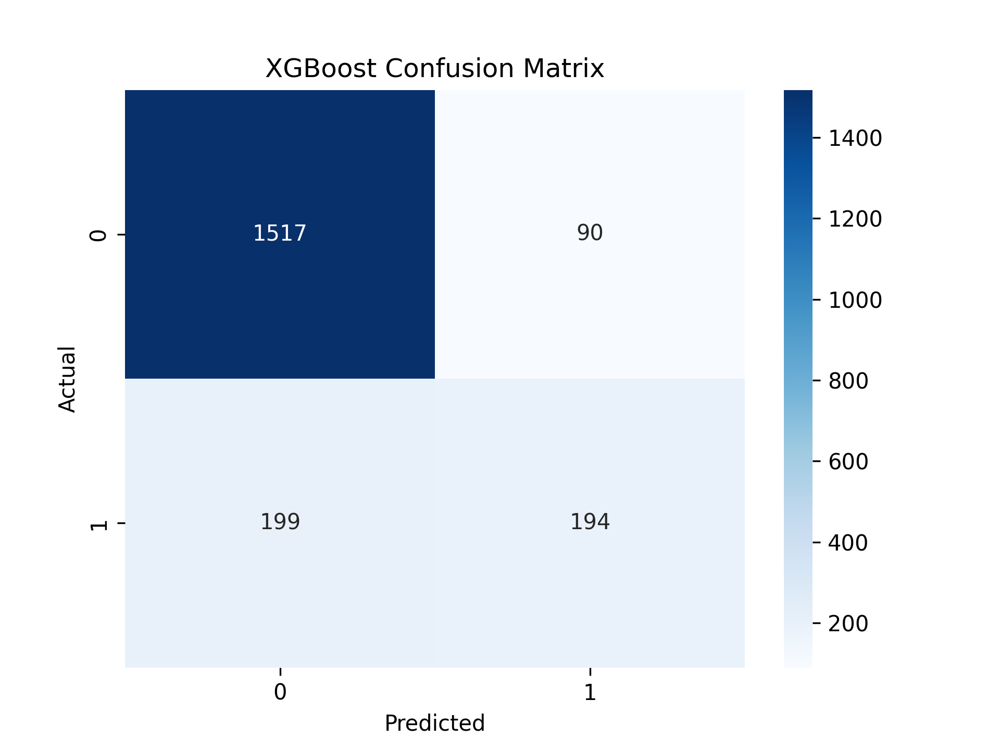
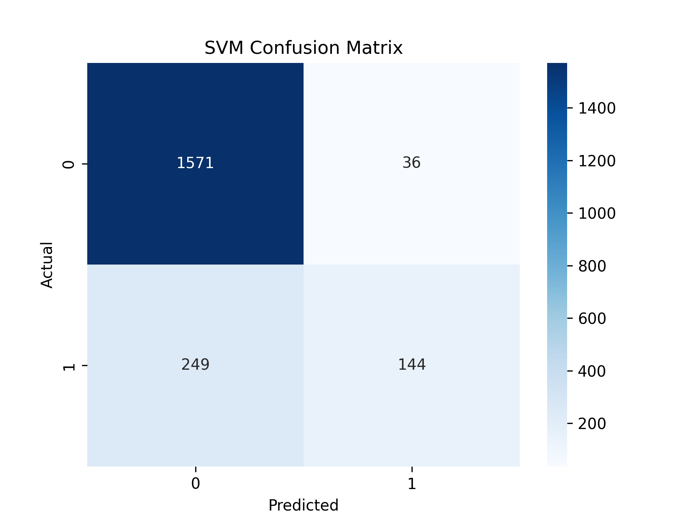
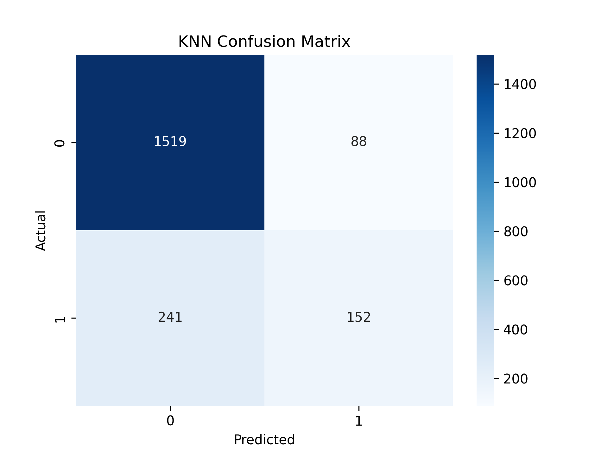
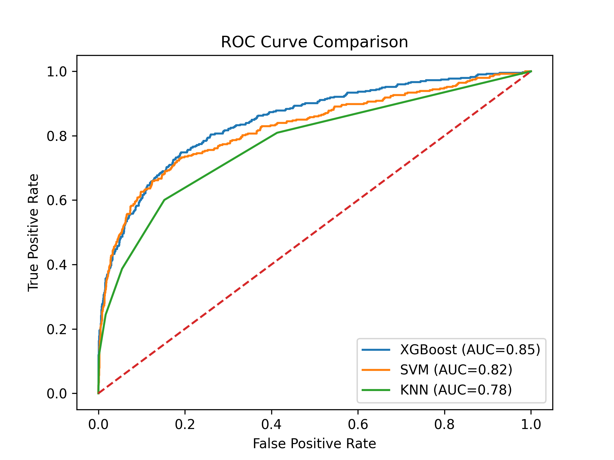

# Model Comparison: XGBoost vs SVM vs KNN

## Dataset
Bank Customer Churn Dataset (Kaggle)

## Models
- XGBoost
- SVM
- KNN

## 📊 Metrics

## 🔍 Confusion Matrices
### XGBoost

### SVM

### KNN

## 📈 ROC Curve

